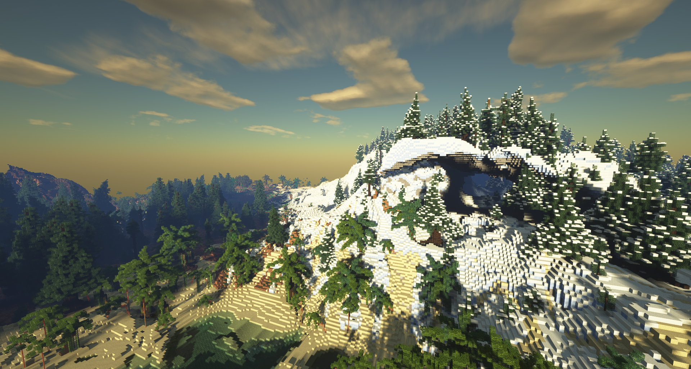
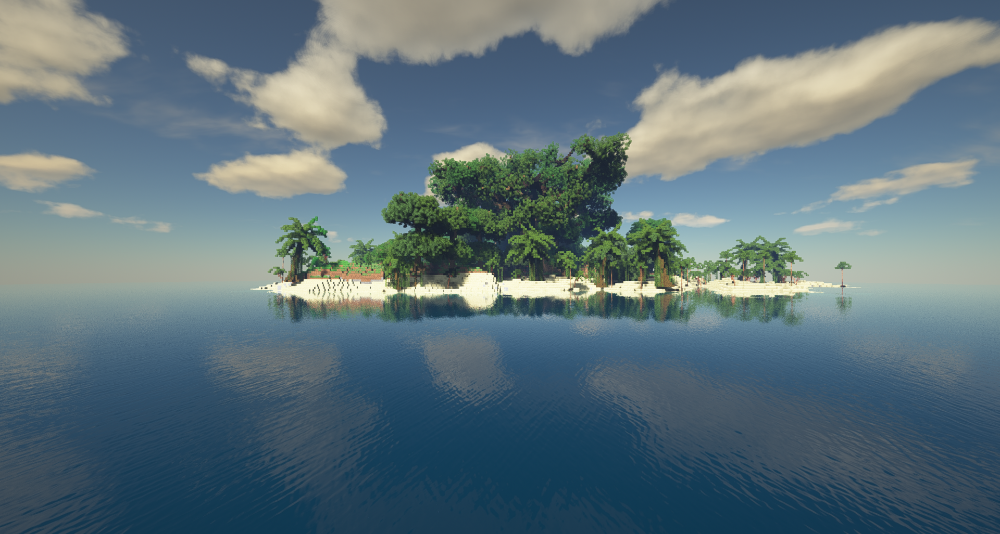
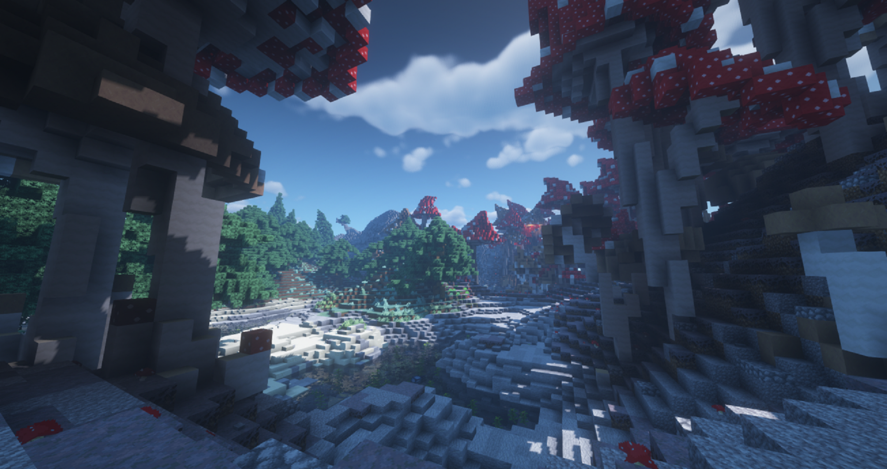

## Preview

## Credits
- [RaydenKoning](https://github.com/RaydenKonig/)
- [NextdoorPsycho](https://github.com/nextdoorpsycho)
- [K530](https://github.com/K530-hub)
- NipNacks *from Discord*
- [StrangeOne](https://github.com/StrangeOne101)
- [CocoTheOwner](https://github.com/CocoTheOwner)
- [FlakeZ]()
- [musikant]()

*And others I didn't write down (sorry)*

Much thanks to all who made screenshots of Iris Creations!

## Installation
1. Clone this repository anywhere on your PC
2. Right-click your desktop and select "personalize"
3. Select the cloned folder under the Backgrounds section
4. Set the mode to "stretch", it appears to give the best results *Feel free to try other modes!*
5. Set the refresh time to anything. I personally use 5 minutes.
6. Enjoy over 80 (and counting) screenshots every time you see your desktop!

## Uploading
Upload your screenshots by making a PR or uploading them to [Here](https://discord.gg/Volmit)
